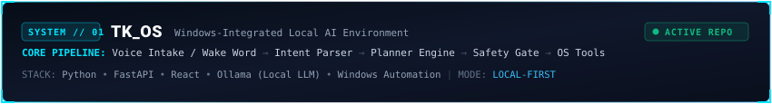
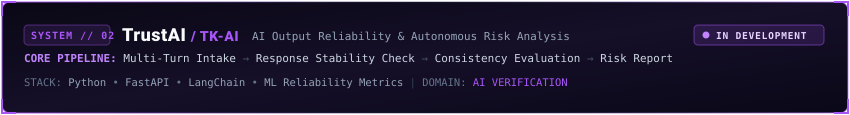
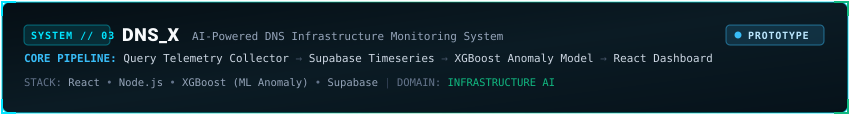

<div align="center">

<!-- ================================================================= -->
<!-- 01 — HERO // TK AI COMMAND CENTER                                -->
<!-- ================================================================= -->



<br>


</div>

<br>

<!-- ================================================================= -->
<!-- 02 — ABOUT // OPERATIONAL PROFILE                                 -->
<!-- ================================================================= -->

### `01 // OPERATIONAL PROFILE`

<div align="center">
  
</div>

```
[OPERATOR_ID]    Tony Kishore
[HANDLE]         @TonyKishore002
[ROLE]           B.Tech Information Technology Student | AI / ML Engineer in the Making
[PRIMARY_FOCUS]  Local LLM Orchestration • Agentic Architectures • System Safety
[PARADIGM]       Deterministic execution around probabilistic foundation models
```

> **"Training AI because my brain needs a backup. Currently debugging both."**

I am an Information Technology undergraduate focused on applied AI engineering and intelligent system development. My work centers on bridging local language models with operating-system-level execution environments—building deterministic planners, reliable tool-execution interfaces, and safety-checking boundaries. Rather than relying solely on cloud APIs, I focus on local-first AI runtimes, quantifiable model reliability, and intelligent automation.

---

<!-- ================================================================= -->
<!-- 03 — CURRENT SYSTEMS // TELEMETRY OVERVIEW                       -->
<!-- ================================================================= -->

### `02 // SYSTEM TELEMETRY & ACTIVE MODULES`

<div align="center">
  
</div>

| Module / System | Domain | Technical Stack | Verified State |
| :--- | :--- | :--- | :--- |
| **`TK_OS`** | Local AI & Desktop Automation | Python • FastAPI • React • Ollama | `ACTIVE REPO` |
| **`TrustAI / TK-AI`** | AI Output Reliability & Risk Analysis | Python • FastAPI • LangChain • ML | `IN DEVELOPMENT` |
| **`DNS_X`** | AI-Powered DNS Infrastructure Monitoring | React • Node.js • XGBoost • Supabase | `PROTOTYPE` |
| **`Emall Management`** | Full-Stack Property Management | Node.js • React • Database Layer | `BUILT` |
| **`TK Portfolio`** | Interactive Developer Hub | React • TypeScript • Vite | `ACTIVE` |

---

<!-- ================================================================= -->
<!-- 04 — TECH STACK // TOOLS & RUNTIMES                              -->
<!-- ================================================================= -->

### `03 // NEURAL INVENTORY & TOOLING MATRIX`

<div align="center">
  
</div>

#### `AI & Machine Learning Core`
```
[RUNTIMES]       Ollama (Local LLMs) • PyTorch
[ORCHESTRATION]  LangChain • Transformers (Hugging Face)
[MODELING]       XGBoost • Scikit-learn
[DOMAINS]        Agent Intent Routing • Tool Chaining • Anomaly Detection
```

#### `Backend & Architecture`
```
[FRAMEWORKS]     FastAPI (Python) • Node.js • Express
[APIS]           RESTful Services • IPC Tool Bridges • Async Daemons
[ENVIRONMENTS]   Python 3.10+ • Node.js 18+
```

#### `Databases & Storage`
```
[DATABASES]      Supabase • PostgreSQL • SQLite
[DATA_TYPES]     Timeseries Metrics • Agent State • Relational Schemas
```

#### `Frontend & User Interface`
```
[CLIENT]         React • Next.js • Vite
[LANGUAGES]      TypeScript • JavaScript • HTML5 / Modern CSS
[STYLING]        Tailwind CSS • Responsive Cyber Dashboards
```

#### `System Environment & Tooling`
```
[SYSTEMS]        Windows CLI & Automation • PowerShell • Linux / WSL
[VERSIONING]     Git • GitHub
[TOOLING]        VS Code • REST Clients • Audio/Audio-Buffer Testing
```

---

<!-- ================================================================= -->
<!-- 05 — FEATURED PROJECTS // ARCHITECTURAL BREAKDOWNS                -->
<!-- ================================================================= -->

### `04 // FEATURED SYSTEMS & TECHNICAL ARCHITECTURE`

<div align="center">
  
</div>

#### `SYSTEM_01 // TK_OS`

<div align="center">
  
</div>

**TK_OS** is a Windows-integrated local AI environment designed to execute desktop tasks through speech and text inputs using local foundation models without relying on remote API latency.

<details>
<summary>⚡ <b>Open TK_OS Technical Architecture & Components</b></summary>

<br>

```
+-----------------------------------------------------------------------------------+
|                              TK_OS ARCHITECTURE                                   |
+-----------------------------------------------------------------------------------+
|                                                                                   |
|  [Voice Intake / Wake Word] ---> [Agent Intent Parser] ---> [Agent Planner]       |
|                                                                     |             |
|                                                                     v             |
|  [Local OS Execution] <--- [Tool Executor] <--- [Safety Boundary Validation Gate] |
|                                      |                                            |
|                                      v                                            |
|                         [Ollama Local Model Worker]                               |
+-----------------------------------------------------------------------------------+
```

- **Implemented Components (Working in Codebase)**:
  - **Wake-Word & Audio Stability Testing**: Local audio intake pipeline with threshold testing for wake-word activation.
  - **Agent Intent Parser**: Classifies user queries into system commands, file operations, or conversational queries.
  - **Core Agent Planner**: Deconstructs user objectives into actionable sequential tasks.
  - **Safety Gate**: Pre-execution verification layer blocking destructive system commands and unauthorized path writes.
  - **File & System Tools**: Execution wrappers for interacting with Windows directory structures, processes, and files.
  - **Local Model Serving**: Connects directly to local models via Ollama.

- **Planned Architecture**:
  - Continuous multi-turn dialogue memory graph.
  - Multi-step automated recovery loops for tool call errors.
  - Multimodal desktop viewport reasoning for visual interface interactions.

</details>

<br>

#### `SYSTEM_02 // TrustAI (TK-AI)`

<div align="center">
  
</div>

**TrustAI** is an AI output reliability and autonomous risk analysis platform engineered to assess output stability, factual drift, and risk variables across multi-turn LLM pipelines.

<details>
<summary>⚡ <b>Open TrustAI Technical Architecture & Components</b></summary>

<br>

```
+-----------------------------------------------------------------------------------+
|                             TrustAI ARCHITECTURE                                  |
+-----------------------------------------------------------------------------------+
|                                                                                   |
|  [Model Output Stream] ---> [LangChain Validator] ---> [Consistency Evaluator]    |
|                                                                |                  |
|                                                                v                  |
|  [Structured Audit Report] <--- [Risk Matrix Scorer] <--- [Heuristic Heuristics]  |
|                                                                                   |
+-----------------------------------------------------------------------------------+
```

- **Implemented Components (Current Design & Prototyping)**:
  - **Multi-Turn Evaluation Pipeline**: Structured test harnesses to compare repeated model generations against baseline prompts.
  - **Consistency Checking**: Logic for detecting semantic variance and output deviations using Python and LangChain.

- **Planned Architecture**:
  - Quantitative automated risk scoring model generating exportable safety reports.
  - Deterministic benchmark suite for hallucination detection across varied temperature thresholds.

</details>

<br>

#### `SYSTEM_03 // DNS_X`

<div align="center">
  
</div>

**DNS_X** is an AI-powered DNS infrastructure monitoring system that analyzes latency spikes, resolution anomalies, and network telemetry.

<details>
<summary>⚡ <b>Open DNS_X Technical Architecture & Components</b></summary>

<br>

```
+-----------------------------------------------------------------------------------+
|                              DNS_X ARCHITECTURE                                   |
+-----------------------------------------------------------------------------------+
|                                                                                   |
|  [DNS Probe Collector] ---> [Timeseries Store (Supabase)] ---> [Feature Pipeline] |
|                                                                        |          |
|                                                                        v          |
|  [React Telemetry UI] <--- [Anomaly Classification] <--- [XGBoost Classifier]     |
|                                                                                   |
+-----------------------------------------------------------------------------------+
```

- **Implemented Components (Working Prototype)**:
  - **Telemetry Probing**: Node.js collector tracking DNS query resolution times and response headers.
  - **Timeseries Storage**: Structured storage of resolution metrics in Supabase PostgreSQL tables.
  - **Anomaly Modeling**: Preliminary classification experiments using XGBoost to detect abnormal latency deviations.
  - **Telemetry Dashboard**: React dashboard visualizing resolution health and query distributions.

- **Planned Architecture**:
  - Real-time automated alerting on localized DNS cache poisoning indicators or latency degradation.
  - Multi-region synthetic DNS probe network.

</details>

<br>

#### `SYSTEM_04 // Emall Property Management`
- **Overview**: Full-stack enterprise property platform engineered for managing residential and commercial properties, lease contracts, and tenant operations.
- **Stack**: Node.js • React • Relational Database • REST API
- **Focus**: Structured data models, role-based access flows, and operational tracking.

<br>

#### `SYSTEM_05 // TK Developer Portfolio`
- **Overview**: High-performance interactive developer portfolio showcasing autonomous systems, engineering specs, and technical projects.
- **Stack**: React • TypeScript • Vite • Modern CSS

---

<!-- ================================================================= -->
<!-- 06 — AI / ML ENGINEERING FOCUS                                    -->
<!-- ================================================================= -->

### `05 // AI / ML CORE COMPETENCIES`

<div align="center">
  
</div>

- **Local Model Orchestration**: Running and tuning open-weights models (e.g. Llama, Mistral, Gemma) on workstation hardware using Ollama without sending proprietary data to external cloud APIs.
- **Agentic Planning & Intent Classification**: Building intent decoders that convert unstructured user prompts into validated, schema-compliant tool calls with pre-condition checks.
- **Execution Safety & Boundaries**: Developing sandboxed file and system action boundaries with human-in-the-loop confirmation before running modifying commands.
- **Applied Tabular & Telemetry Machine Learning**: Applying tree-based algorithms (XGBoost, Scikit-learn) to latency series and network log datasets for anomaly and failure detection.

---

<!-- ================================================================= -->
<!-- 07 — GITHUB ACTIVITY & METRICS                                    -->
<!-- ================================================================= -->

### `06 // GITHUB TELEMETRY & ACTIVITY`

<div align="center">
  
</div>

<div align="center">
  <a href="https://github.com/TonyKishore002">
    
  </a>
  &nbsp;
  <a href="https://github.com/TonyKishore002">
    
  </a>
</div>

<div align="center">
  <sub><i>Note: GitHub metrics query live activity for @TonyKishore002. Fallback styling matches the TK-01 dark command console.</i></sub>
</div>

---

<!-- ================================================================= -->
<!-- 08 — DEVELOPMENT ROADMAP & MILESTONES                             -->
<!-- ================================================================= -->

### `07 // SYSTEM LOGS & DEVELOPMENT ROADMAP`

<div align="center">
  
</div>

```
[SYSTEM LOG: ROADMAP TELEMETRY]
-----------------------------------------------------------------------------
[x] TK_OS: Local wake-word stability evaluation and threshold test harness
[x] TK_OS: Agent intent classifier and deterministic plan generator
[x] TK_OS: Safety boundary gate for file and system tool actions
[x] DNS_X: Telemetry probe collector and Supabase timeseries schema
[ ] TrustAI: Automated hallucination detection and consistency scoring metrics
[ ] DNS_X: Streaming anomaly detection deployment with alert triggers
[ ] TK_OS: Dynamic multi-step tool chaining with automatic failure recovery
```

---

<!-- ================================================================= -->
<!-- 09 — CONNECT // TRANSMISSION CHANNELS                             -->
<!-- ================================================================= -->

### `08 // TRANSMISSION CHANNELS`

<div align="center">
  
</div>

<br>

<div align="center">

[](https://github.com/TonyKishore002)
&nbsp;
[](https://linkedin.com)
&nbsp;
[](mailto:tonykishore@example.com)

</div>

<br>

<div align="center">
  <code>TK AI COMMAND CENTER // NODE: TK-01 // CORE: LOCAL-AI // MODE: LOCAL-FIRST // STATUS: ONLINE // PROFILE: 2026</code>
</div>
