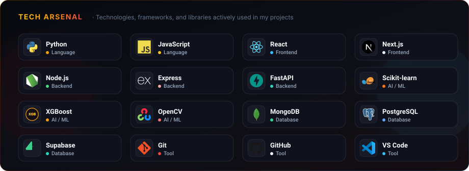

  

 

  Hi! I'm <strong>Tony K</strong>, a B.Tech Information Technology student focused on AI/ML, AI Engineering, and Software Development. I enjoy building practical software and intelligent systems that solve real-world problems.

  

### 🛠 Tech Arsenal

  

  

### 🚀 Featured Projects

#### [TK_OS](https://github.com/TonyKishore002/TK_OS)
A Windows-integrated local AI environment designed to interact with the computer through voice, memory, and tools.
- **Technologies:** Python · FastAPI · Ollama · React

#### TrustAI
An AI output reliability and risk analysis platform designed to analyze AI-generated responses and identify potential risks.
- **Technologies:** Python · FastAPI · Machine Learning  
- *Status: In active development*

#### DNS_X
An AI-powered DNS infrastructure monitoring system focused on detecting anomalies and identifying possible infrastructure problems.
- **Technologies:** Python · XGBoost · Node.js · Supabase  
- *Status: Prototype*

#### [eMall Property Management](https://github.com/TonyKishore002/Emall-Property-Management)
A property management application built using Node.js, Express, MongoDB, and a web frontend.
- **Technologies:** Node.js · Express · MongoDB · JavaScript

  

### 📚 Currently Learning

- Machine Learning
- AI Engineering
- Computer Vision
- System Design
- Advanced React
- Backend Development

  

### 📊 GitHub Stats

  
  

  

### 🌐 Connect

  
  &nbsp;
  
  &nbsp;
  
  &nbsp;
  

  

